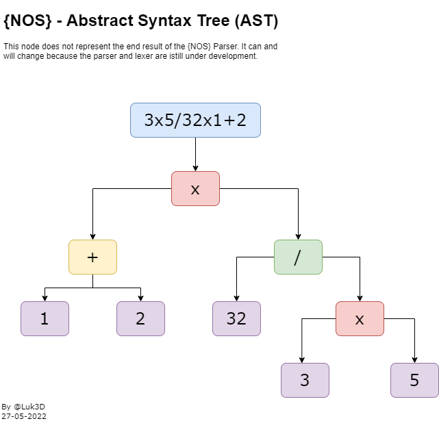

# 

## 😌 WELCOME TO PROJECT {NOS}

{Nos} (Nós), Its an interpreted language written in Rust.

The focus of this project is to create a language that can be easier to learn.

### little example application to show the {NOS} Syntax 🙂

```cs
/*
  ┌─────────────────────────────────────────────────────────────────────────┐
  │ BASIC NOS CODE EXAMPLE                                                  |
  | 23/05/2022 - luk3d                                                      │
  └─────────────────────────────────────────────────────────────────────────┘
 */

def name s = 'Filipe Lukebana';
def number_1 i = 2;
def number_2 f = 34;
def is_gather b = fls;


/** Defining a New Function**/
fn main (def cmd_arguments stack<s>) {
    out('Enter the name: '); //Print a message on cmd
    name = in(); //reading the user input
    out('Enter the first Number: ');
    number_1 = i.parse(in());
    out('Enter the Second Number: ');
    number_2 = i.parse(in());
    /**Adding two numbers**/
    add(number_1,number_2);
}

/** Function to add two numbers**/
fn add (def n1 f, def n2 f)->i {
    rtn n1+n2;
}


/** Function that returns a Stack of Numbers**/
fn range(def number f)->stack<f>{
    def numbers stack<f> = [];
    def counter i = 0;
    loop(fn(){
        number.add(counter);
        counter++;
        if(counter == number){
            breack;
        }
    });
    return numbers;
}

/** Function to get the even numbers between 0 "number" x **/
fn evenNumbers(def number f){
    def numbers stack<f> = [];
    loop.on(range(number),fn(_i){
        if((_i%2) == 0){
            numbers.add(_i);
        }
    });
    return numbers;
}

```


# 🚀 CURRENT STATE 

## Lexer / Tokenizer

Example:
```js
INPUT -> 1.2+22+1.3/4
//The above input is tanslated to this tokens by the {NOS} Lexer
OUTPUT-> [FLOAT:1.2][PLUS][INTEGER:22][MULTIPLY][FLOAT:1.3][DIVIDE][INTEGER:4]
```
## Parser
### Abstract Syntax Tree (AST)
Example:

```js
INPUT -> 1+2*32/3*5
//The above input is translated to this tokens by the {NOS} Parser 😀
(
    ComplexExpression: Operator: * 
        (
            (
                BinaryExpression: operator: + 
                    (
                        NumericLiteral: 1, NumericLiteral: 2
                    ) , 
                    (
                        ComplexExpression: Operator: / 
                            (
                                BinaryExpression: NumericLiteral: 32 , 
                                (
                                    (
                                        BinaryExpression: operator: * 
                                            (
                                                NumericLiteral: 3, NumericLiteral: 5
                                            )
                                    )
                                )
                            )
                    )
            )
        )
)
```
-------------------------------------------

The above Example Represented as Graph.



devellopment 


<!-- ## [NOS-IDE](https://github.com/LUK3D-Angola/Nos_IDE "repositorio oficial da IDE") -->

> In progress...
